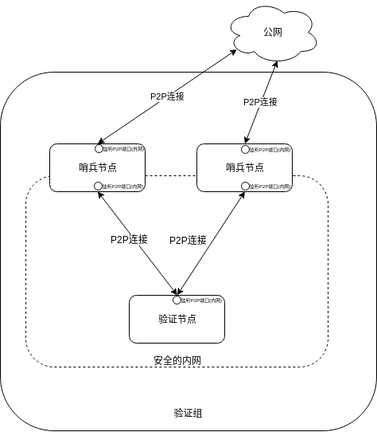
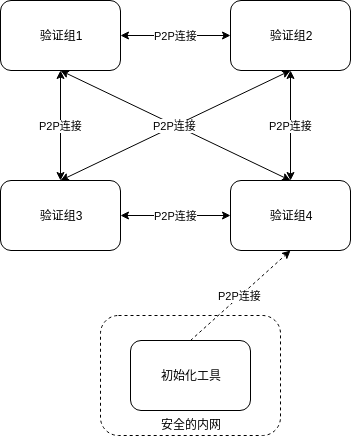
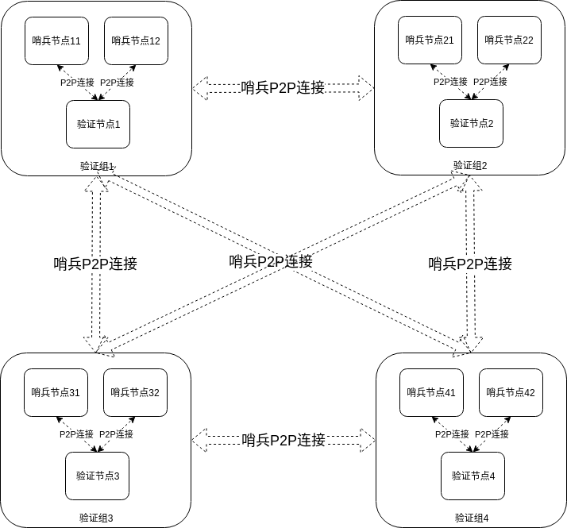

# 从零开始组网部署

## 术语

术语      | 说明  
---------|:-------------------
 全节点   | 区块链的链节点，包含了节点钱包、全量的区块链数据、P2P网络功能等；
 发行工具 |  用来离线生成发行账户、验证节点账户、最初始创世区块配置文件(genesis.json)等
 验证节点 |  做共识出区块的全节点
 哨兵节点 |  特殊的观察节点，不出区块；  为使验证节点隐藏在安全的网络与之内，作为验证节点的代理，暴露在公网；
 观察节点 |  普通全节点，不出区块
   
  

## 网络拓扑
### 验证组



### 验证组的连接



### 验证组的连接（明细）

为方便本文档中部署的操作描述，做如下节点命名

验证组    | 内部节点的命名  
---------|:-------------------
 验证组1  | 验证节点1、哨兵节点11、哨兵节点12
 验证组2  | 验证节点2、哨兵节点21、哨兵节点22
 验证组3  | 验证节点3、哨兵节点31、哨兵节点32
 验证组4  | 验证节点4、哨兵节点41、哨兵节点42
 


## 使用发行工具生成核心账户

### 发行工具列表
hsd、hscli

### 初始化
MyMoniker （网络的绰号）；如 Apple、Banana等

MyChainName（链的名称） ; 如 mainnet、testnet、testnet1、testnet2

  
``` 
    hsd init $(MyMoniker) --chain-id $(MyChainName)
```

### 新生成五个账户  
其中 HTDF_ISSUE_ACCT 是 是央行账户（发行账户）

**注意**
 - 以下 12345678 是相关账户的密码，是极度重要关乎整个区块链生死的密码，请自行调整并妥善保管
 - 以下 1000000000000000satoshi、 10000000000000000stake 根据需要自行调整


```
    HTDF_ISSUE_ACCT=`hscli accounts new  12345678`
    ACCT1=`hscli accounts new  12345678`
    ACCT2=`hscli accounts new  12345678`    
    ACCT3=`hscli accounts new  12345678`
    ACCT4=`hscli accounts new  12345678`    
    
    hsd add-genesis-account $HTDF_ISSUE_ACCT 1000000000000000satoshi
    hsd add-genesis-account $ACCT1           10000000000000000stake
    hsd add-genesis-account $ACCT2           10000000000000000stake
    hsd add-genesis-account $ACCT3           10000000000000000stake
    hsd add-genesis-account $ACCT4           10000000000000000stake    
    
    hscli accounts list
    
```


## 8个哨兵节点初始化

```
    #哨兵节点11
    hsd init $(MyMoniker) --chain-id $(MyChainName)
    #哨兵节点12
    hsd init $(MyMoniker) --chain-id $(MyChainName)
    #哨兵节点21
    hsd init $(MyMoniker) --chain-id $(MyChainName)
    #哨兵节点22
    hsd init $(MyMoniker) --chain-id $(MyChainName)
    #哨兵节点31
    hsd init $(MyMoniker) --chain-id $(MyChainName)
    #哨兵节点32
    hsd init $(MyMoniker) --chain-id $(MyChainName)
    #哨兵节点41
    hsd init $(MyMoniker) --chain-id $(MyChainName)
    #哨兵节点42
    hsd init $(MyMoniker) --chain-id $(MyChainName)        
```


## 配置4个验证节点
### 验证节点初始化
```
    #验证节点1
    hsd init $(MyMoniker) --chain-id $(MyChainName)
    
    #验证节点2
    hsd init $(MyMoniker) --chain-id $(MyChainName)
    
    #验证节点3
    hsd init $(MyMoniker) --chain-id $(MyChainName)
    
    #验证节点4
    hsd init $(MyMoniker) --chain-id $(MyChainName)
```
 
### 拷贝配置文件
将发行工具生成的创世区块配置文件(genesis.json)和keyfile，拷贝到验证节点

genesis.json 目录在 ~/.hsd/config/
keyfile 目录在      ~/.hscli/keystores


```    
    #验证节点1： 拷贝创世区块配置文件(genesis.json) 和 $ACCT1 keyFile
    #验证节点2： 拷贝创世区块配置文件(genesis.json) 和 $ACCT2 keyFile
    #验证节点3： 拷贝创世区块配置文件(genesis.json) 和 $ACCT3 keyFile
    #验证节点4： 拷贝创世区块配置文件(genesis.json) 和 $ACCT4 keyFile
```    
    	
### 生成gentx并签名
```    
    #验证节点1    
    hsd gentx $ACCT1
    hsd collect-gentxs
      
    #验证节点2
    hsd gentx $ACCT2
    hsd collect-gentxs
      
    #验证节点3
    hsd gentx $ACCT3
    hsd collect-gentxs
    
    #验证节点4
    hsd gentx $ACCT4
    hsd collect-gentxs
```

### 编辑创世区块配置文件(genesis.json)     
- 先备份验证节点1 的创世区块配置（genesis.json）

- 编辑验证节点1的创世区块配置（genesis.json）
 >  把其他三个节点创世区块配置（genesis.json）中的 gentx 拷贝过来;
 >  并追加到验证节点1的创世区块配置（genesis.json）的gentx中
 >  这个就是最终的创世区块配置文件(genesis.json)

- 把验证节点1 的最新 genesis.json，拷贝到 验证节点2、验证节点3、验证节点4

- 做完以上步骤后， 4个验证节点的创世区块配置（genesis.json） 是一致的(比对各文件的md5sum)


## 配置网络发现的参数
### 查询8个哨兵节点的NodeID

```
    #哨兵节点11
    SentinelNodeID11=`hsd tendermint show-node-id`
    #哨兵节点12
    SentinelNodeID12=`hsd tendermint show-node-id`
    #哨兵节点21
    SentinelNodeID21=`hsd tendermint show-node-id`
    #哨兵节点22
    SentinelNodeID22=`hsd tendermint show-node-id`
    #哨兵节点31
    SentinelNodeID31=`hsd tendermint show-node-id`
    #哨兵节点32
    SentinelNodeID32=`hsd tendermint show-node-id`
    #哨兵节点41
    SentinelNodeID41=`hsd tendermint show-node-id`
    #哨兵节点42
    SentinelNodeID42=`hsd tendermint show-node-id`
```

### 4个验证节点，连接组内的哨兵节点
4个验证节点  ~/.hsd/config/config.toml  的 private_peer_ids ，填上组内两个哨兵节点的特征值 "SentinelNodeID@IP"（多个特征值用逗号"," 分隔）

注意哨兵节点IP填写的是内网IP

```
    #验证节点1
    private_peer_ids="SentinelNodeID11@Sentinel_11_PRIVATEIPPORT,SentinelNodeID12@Sentinel_12_PRIVATEIPPORT"
    
    #验证节点2
    private_peer_ids="SentinelNodeID21@Sentinel_21_PRIVATEIPPORT,SentinelNodeID22@Sentinel_22_PRIVATEIPPORT"
    
    #验证节点3
    private_peer_ids="SentinelNodeID31@Sentinel_31_PRIVATEIPPORT,SentinelNodeID32@Sentinel_32_PRIVATEIPPORT"
    
    #验证节点4
    private_peer_ids="SentinelNodeID41@Sentinel_41_PRIVATEIPPORT,SentinelNodeID42@Sentinel_42_PRIVATEIPPORT"

```


### 验证节点不对外暴露节点信息
4个验证节点  ~/.hsd/config/config.toml  的 pex 参数，设置为 false（不对外暴露 验证节点的节点信息）

```
    #验证节点1
    pex=false
    
    #验证节点2
    pex=false
    
    #验证节点3
    pex=false
    
    #验证节点4
    pex=false
```

## 配置8个哨兵节点

### 哨兵节点初始化
请确认，以上第一个步骤已经进行过哨兵节点的初始化    

### 拷贝、修改配置文件

将验证节点的创世区块配置文件(genesis.json)，拷贝到8个哨兵节点(记得比对两边的 md5sum)

genesis.json 目录在 ~/.hsd/config/


### 8个哨兵节点，组网配置

查询4个验证节点的NodeID

```
    #验证节点1
    ValidatorNodeID1=`hsd tendermint show-node-id`
    #验证节点2
    ValidatorNodeID2=`hsd tendermint show-node-id`
    #验证节点3
    ValidatorNodeID3=`hsd tendermint show-node-id`
    #验证节点4
    ValidatorNodeID4=`hsd tendermint show-node-id`    

```

8个哨兵节点~/.hsd/config/config.toml 的 private_peer_ids 连接组内的验证节点；persistent_peers，连接的是其他三个组的哨兵节点

即 private_peer_ids 里是验证节点的内网IP， persistent_peers 里是哨兵节点的公网IP

```
    #哨兵节点11
    private_peer_ids="ValidatorNodeID1@Validator_1_IPPORT"
    persistent_peers="SentinelNodeID21@Sentinel_21_PUBLICIPPORT,SentinelNodeID31@Sentinel_31_PUBLICIPPORT,SentinelNodeID41@Sentinel_41_PUBLICIPPORT"    

    #哨兵节点12
    private_peer_ids="ValidatorNodeID1@Validator_1_IPPORT"
    persistent_peers="SentinelNodeID22@Sentinel_22_PUBLICIPPORT,SentinelNodeID32@Sentinel_32_PUBLICIPPORT,SentinelNodeID42@Sentinel_42_PUBLICIPPORT"
    
    #哨兵节点21
    private_peer_ids="ValidatorNodeID2@Validator_2_IPPORT"
    persistent_peers="SentinelNodeID11@Sentinel_11_PUBLICIPPORT,SentinelNodeID31@Sentinel_31_PUBLICIPPORT,SentinelNodeID41@Sentinel_41_PUBLICIPPORT"
    
    #哨兵节点22
    private_peer_ids="ValidatorNodeID2@Validator_2_IPPORT"
    persistent_peers="SentinelNodeID12@Sentinel_12_PUBLICIPPORT,SentinelNodeID32@Sentinel_32_PUBLICIPPORT,SentinelNodeID42@Sentinel_42_PUBLICIPPORT"
    
    #哨兵节点31
    private_peer_ids="ValidatorNodeID3@Validator_3_IPPORT"
    persistent_peers="SentinelNodeID11@Sentinel_11_PUBLICIPPORT,SentinelNodeID21@Sentinel_21_PUBLICIPPORT,SentinelNodeID41@Sentinel_41_PUBLICIPPORT"
    
    #哨兵节点32
    private_peer_ids="ValidatorNodeID3@Validator_3_IPPORT"
    persistent_peers="SentinelNodeID12@Sentinel_12_PUBLICIPPORT,SentinelNodeID22@Sentinel_22_PUBLICIPPORT,SentinelNodeID42@Sentinel_42_PUBLICIPPORT"
    
    #哨兵节点41
    private_peer_ids="ValidatorNodeID4@Validator_4_IPPORT"
    persistent_peers="SentinelNodeID11@Sentinel_11_PUBLICIPPORT,SentinelNodeID21@Sentinel_21_PUBLICIPPORT,SentinelNodeID31@Sentinel_31_PUBLICIPPORT"
    
    #哨兵节点42
    private_peer_ids="ValidatorNodeID4@Validator_4_IPPORT"
    persistent_peers="SentinelNodeID12@Sentinel_12_PUBLICIPPORT,SentinelNodeID22@Sentinel_22_PUBLICIPPORT,SentinelNodeID32@Sentinel_32_PUBLICIPPORT"
```


## 启动节点

### 启动8个哨兵节点
启动8个哨兵节点

日志文件名及目录，请根据需要调整
```
    #启动app进程    
    nohup hsd start >> $(HOME)/.hsd/app.log  2>&1  &
    
    #启动restServer
    nohup hscli rest-server --chain-id=$(MyChainName) --trust-node=true  --laddr=tcp://0.0.0.0:1317  >> $(HOME)/.hsd/restServer.log  2>&1  &

```

观察日志，查看各哨兵节点间的连接是否正常；
由于目前只有哨兵节点，暂时看不到出块的日志
```
    #当前节点
    tail -f $(HOME)/.hsd/app.log        
```


### 启动4个验证节点
启动4个验证节点

日志文件名及目录，请根据需要调整
```
    #启动app进程    
    nohup hsd start >> $(HOME)/.hsd/app.log  2>&1  &
    
    #启动restServer
    nohup hscli rest-server --chain-id=$(MyChainName) --trust-node=true  --laddr=tcp://0.0.0.0:1317  >> $(HOME)/.hsd/restServer.log  2>&1  &
    
```

观察日志，查看4个验证节点和8个哨兵节点连接是否正常，是否有出块日志
```
    #当前节点
    tail -f $(HOME)/.hsd/app.log    
```


     


